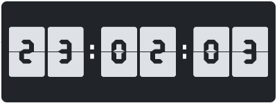
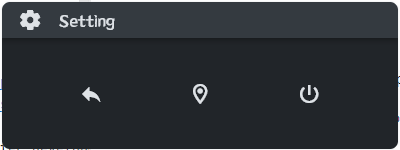
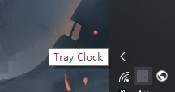
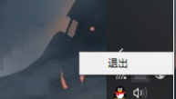

# tray_clock

A simple clock.

- For Windows users, obtain from `Release`, download and decompress and double-click `tray_clock.exe` to experience.
- For Linux/macOS users, it is necessary to pull the source code and rerun the build command to generate platform
  specific
  executable files.

# screenshots

Default panel (a simple flip clock)

---

Settings panel (with **back**, **always-on-top** and **close** buttons)

---

Tray panel (tooltip)

---

Traypane (menu, both **left** and **right** clickable and contains **only** the **close** button (because it's toooooo
simple))